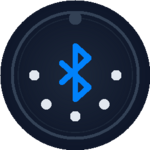
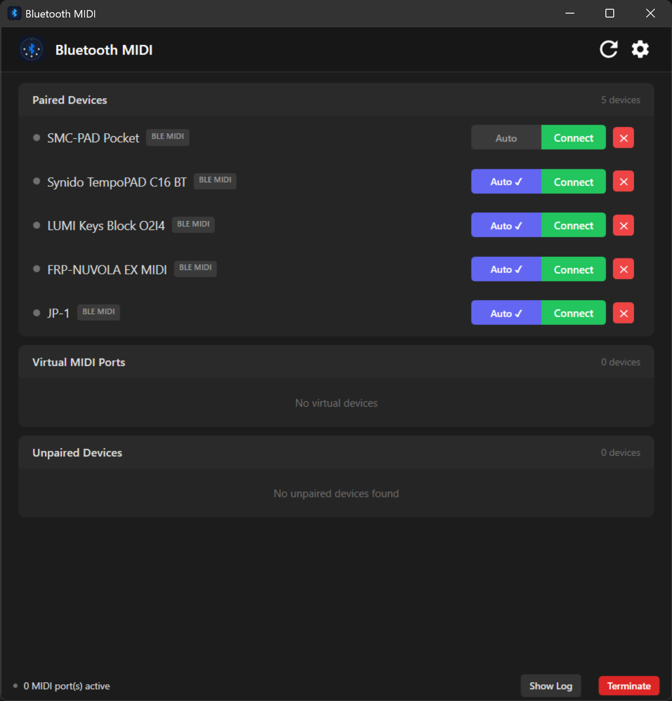

  

<h1 align="center">BluetoothMIDI</h1>

Use your Bluetooth MIDI instruments in any DAW on Windows — wirelessly, no cables required.

---

**BluetoothMIDI** is a lightweight Windows app that connects Bluetooth LE MIDI devices (keyboards, pad controllers, wind instruments, guitar processors…) to **virtual MIDI ports**, so they show up in any DAW or music software just like a USB MIDI device would.

> This repository is the public home for **support and documentation only** — it intentionally contains no source code. The app is distributed through the Microsoft Store.

## ✨ What it does

- **Finds your devices for you.** The app scans for nearby Bluetooth LE MIDI devices — including ones you haven't paired yet — and connects them from within the app, no trip to Windows Settings required. Non-MIDI Bluetooth gadgets are filtered out automatically.
- **Bridges each device to a virtual MIDI port** carrying the device's own name, visible to every DAW and MIDI application on the system.
- **Two-way forwarding with minimal overhead.** Notes flow from the instrument to your software, and MIDI sent by your software flows back to the device. The app's own processing adds virtually no delay on top of the Bluetooth link (see the latency note below).
- **Auto-connect.** Mark a device once and the app reconnects it automatically whenever it's in range and powered on — with a notification when a reconnection completes in the background.
- **Battery monitoring** for devices that report their charge level.
- **Lives in the system tray.** Closing the window keeps the bridge running in the background; reopen it from the tray icon.
- **Start with Windows** (optional), so your instruments are ready as soon as you sit down.
- **MIDI monitor** window for watching the live message stream — handy for troubleshooting a controller.
- **Self-healing.** If the Windows MIDI service restarts or misbehaves, the app rebuilds its connections in place — your DAW keeps seeing the same port.
- **Light, dark, or system theme.**

## 🚀 Getting started

1. **Install the app** from the Microsoft Store.
2. **First launch:** the app depends on **Windows MIDI Services**, Microsoft's new MIDI stack. Its core components are part of Windows 11 itself — Microsoft has been rolling them out to up-to-date systems through Windows Update since early 2026, so your machine may already have them. On top of that, the app needs Microsoft's small **MIDI Services SDK runtime** package; if it's missing, the app offers to install it — accept the one-time admin prompt. Prefer to handle it yourself? Install it before the app, either with `winget install Microsoft.WindowsMIDIServicesSDK` or from Microsoft's official repository at [github.com/microsoft/MIDI](https://github.com/microsoft/MIDI/releases), and the prompt won't appear at all.
3. **Power on your Bluetooth MIDI device** and put it in range. It appears in the device list within a few seconds.
4. **Pair the device.** New devices show up as unpaired at first — pair them right from the app, no trip to Windows Settings needed.
5. **Enable the device** in the list. A virtual MIDI port with the device's name is created.
6. **Open your DAW** and select that port as a MIDI input (and output, if your device accepts MIDI back).
7. That's it — play. Closing the window minimizes the app to the tray and keeps everything connected.

**Requirements:** Windows 11 (24H2 or later) or Windows 10 22H2, a Bluetooth LE-capable adapter, and a Bluetooth MIDI (BLE-MIDI) device.

### A note on latency

Bluetooth MIDI is wireless, and the radio link itself has inherent latency — typically somewhere in the tens of milliseconds, depending on your Bluetooth adapter, the instrument, and signal conditions. That's more than a USB cable, and no software can remove the radio's share of it. What this app does is keep **its own** contribution as close to zero as possible, so what you feel is the Bluetooth link and nothing more. For practice and most live playing this feels immediate; for very tight recording takes, a USB connection (where your device offers one) will always be the lower-latency option.

## 🖼️ Screenshots

  

## 🛟 Support

- **Preferred:** open an [issue](../../issues) in this repository — it keeps the conversation trackable and helps other users with the same problem.
- **Email:** asr.services@hotmail.com

### Attaching logs to a support request

The app writes diagnostic logs **locally on your computer** (they are never sent anywhere automatically — see the [privacy policy](PRIVACY.md)). Attaching them to your report makes most problems much faster to diagnose:

1. Press <kbd>Win</kbd>+<kbd>R</kbd>, paste `%LOCALAPPDATA%\BluetoothMIDI`, press Enter.
2. Attach the relevant `.log` files (`startup.log`, `debug.log`, `sdk_install.log`) to the GitHub issue (preferred) or the email.

Along with the logs, please include your Windows version, the Bluetooth MIDI device model, and what you expected vs. what happened.

## 📄 Privacy

The app collects nothing, transmits nothing, and has no telemetry — everything stays on your computer. Full policy: **[PRIVACY.md](PRIVACY.md)**

## ⚖️ Legal

© 2026 Alex Santos Ramos. **All rights reserved.**

The contents of this repository (documentation, text, and images) may not be reused or redistributed without permission. The BluetoothMIDI application is proprietary software.

*Bluetooth® is a registered trademark of Bluetooth SIG, Inc. Windows is a trademark of Microsoft Corporation. All trademarks are property of their respective owners.*
